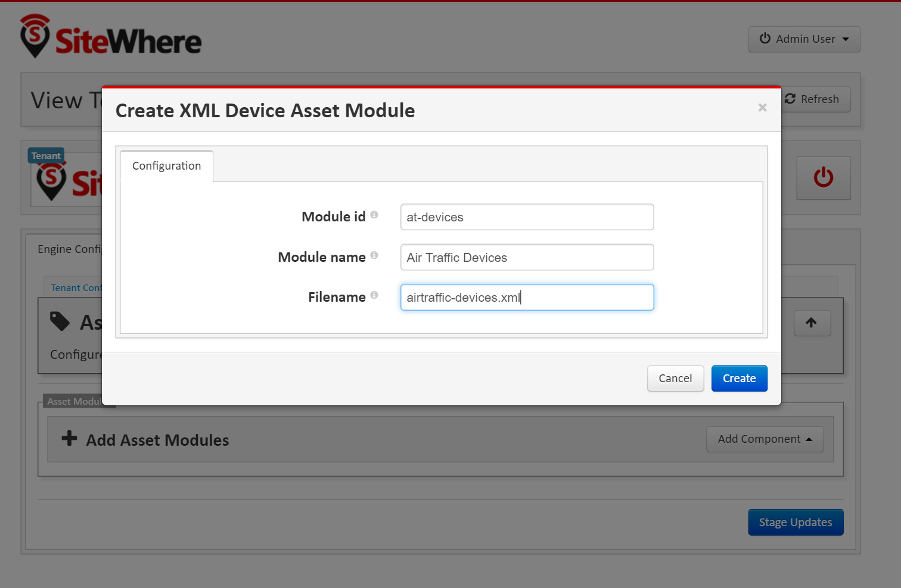
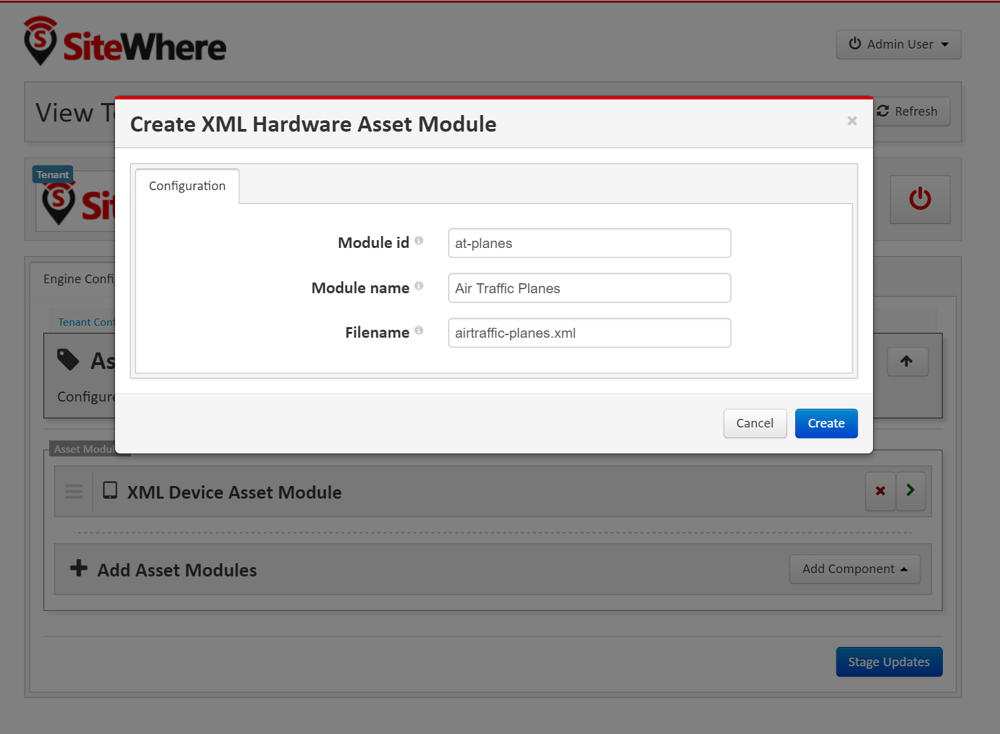

![SiteWhere] (https://s3.amazonaws.com/sitewhere-demo/sitewhere-small.png)

# SiteWhere Air Traffic Control Example
This example project features a web application that displays a map with
many planes being tracked based on simulated data being generated into 
SiteWhere. It shows many key SiteWhere features including the use of device
management and asset managment capabilities via REST services, ingestion
of data via the Stomp protocol, and visualization of data in real-time.

## Set Up SiteWhere
Start by setting up a local or cloud instance of SiteWhere that will
host the devices and other data used by the application. You can download
the latest distribution on the [downloads](http://www.sitewhere.org/downloads/) 
page. Set up the other components such as the database and MQTT broker
as explained in the [installation guide](http://documentation.sitewhere.org/userguide/installation.html).

## Download the Air Traffic Example
Using a Git client, clone the SiteWhere examples project using the command:

> git clone https://github.com/sitewhere/sitewhere-examples.git

## Prepare SiteWhere Instance
Before running the example, the SiteWhere instance should be configured with the
assets expected by the air traffic domain as well as an event source to accept
STOMP data from the external application.

### Add Asset Modules
Start by creating a new **assets** folder in the SiteWhere **conf** folder. Copy the
asset XML files from the example project (in the **config/assets** folder) into the
newly created folder in the SiteWhere instance.

Open the tenant configuration editor for the default tenant and choose to **XML Device Asset Module** from
the dropdown.

Fill in the details to point to the XML file copied earlier as shown below:

Next, add an **XML Hardware Asset Module** and fill in the details to point to the XML file
containing plane assets as shown below:

## Start Air Traffic Example
Navigate to the **air-traffic** folder and execute:

> mvn clean install

The end result of the build is a file **airtraffic.war** being generated into
the **deploy** folder. Copy the war file into the **webapps** folder in your 
SiteWhere instance. You will also need to copy the contents of the
**config/sitewhere** folder to the **conf/sitewhere** folder of your SiteWhere
instance. The configuration files include:

* **sitewhere-server.xml** - The global SiteWhere configuration which determines
the database used and other global settings.
* **tenants/default/sitewhere-tenant.xml** - The configuration file for the default tenant
with extra configurations added to support the air traffic example. An extra ActiveMQ
event source has been added to listen for Stomp data being generated by the web application.
Two new asset modules have been added for the tracker and plane assets.
* **assets/airtraffic-*.xml** - These are XML files that contain asset definitions
used in the air traffic example. SiteWhere allows assets to be defined in the database,
externally in asset management systems, or locally in XML files.

### Air Traffic Example Boot Process
After SiteWhere is started, the air traffic example application loads its model
via the SiteWhere REST services. It creates device specifications around the tracker
assets and creates device instances for a tracker per plane. It also creates a 
device assignment for each tracker which corresponds to a plane. 

### Real-time Data Generation via Stomp
Once the model has been dynamically loaded, the application starts generating data in real-time
based on the [Stomp](https://stomp.github.io/) protocol. Stomp is a simple connection-oriented
protocol that allows data to be streamed quickly into the system. In this case, SiteWhere
calculates a route for each plane, subdivides it into chunks, and calculates values for each
step of the route. Information simulated includes location, altitude, fuel level, air speed,
and direction. By default, this corresponds to 2 events (location and measurements) for each
plane (x30 planes) per second for a total of 60 events per second.

### Viewing the User Interface
The air traffic example includes a user interface with a map of the United States with plane
icons superimposed to indicate the current position and direction. The color of the plane
icon also indicates the current fuel level -- progressing from green to red as the level 
decreases. The user interface for the example can be accessed from the following URL:

> http://localhost:8080/airtraffic
